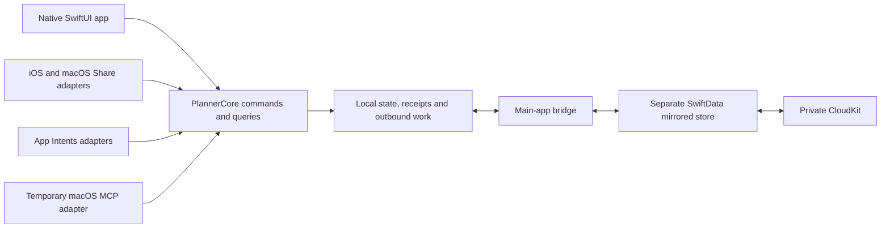

# Core architecture

Decision record in progress for [Core architecture](https://github.com/dvcol/planner/issues/12), claimed for the 2026-10-08 architecture discussion. The human accepted A1-A6 individually through the question tool. They settle target topology, per-device sort preferences, valid selection during refresh, permitted deletion metadata, Share setup/migration and Item timestamp meaning. Other recommendations are proposals, not accepted decisions. No runnable project, schema, public Swift signature, runtime save mechanism or prototype result is approved by this record yet.

## Context and starting state

The map's destination is an implementation-ready specification with demonstrated native feasibility, not production delivery. The repository contains planning documents but no runnable app or package. Native Xcode and a local PlannerCore Swift package are already accepted in [Build workflow](https://github.com/dvcol/planner/issues/18). The named architecture blockers are closed: Apple capabilities, Duration and search, Itineraries and scheduling, Offline conflicts and recovery, URL and share capture, Build workflow and Native long-list capabilities.

The architecture must keep the accepted [completion](completion-scopes.md), [scheduling](itineraries-and-scheduling.md), [capture](url-and-share-capture.md), [recovery](offline-conflicts-and-recovery.md) and [search](duration-and-search.md) behavior. Shared Item content stays live. Each itinerary item appearance has independent local completion; global Item Done overrides display without overwriting local flags. Progress counts item appearances, including repeated List expansion. Containers derive completion and their bulk actions remain local. There is no Trash or automatic visit lifecycle. Apple Calendar export remains outside the map.

Saved on this device requires both local persistence and independent recoverability under R21. Bulk/import failures must retain the approved local state. Host/extension termination cannot be described as rollback or success without resolving the operation. Old-account recovery cannot automatically upload into a different account. These requirements are not weakened by selecting a simpler design.

## Verified facts and their limits

Read-only fact investigations checked Apple primary sources and installed Xcode 27 SDK declarations. They did not run prototypes or change provisioning/accounts.

| Fact and primary source | Consequence for this design |
| --- | --- |
| Apple supports one [multiplatform app target](https://developer.apple.com/documentation/xcode/configuring-a-multiplatform-app-target) with platform-specific experiences and configuration. | Native iPad/Mac layouts do not require separate app targets. Accepted A1 selects this topology; conditional embedding/configuration needs actual builds. |
| Share integrations have their own [extension targets](https://developer.apple.com/library/archive/documentation/General/Conceptual/ExtensibilityPG/ExtensionCreation.html) and [platform controllers](https://developer.apple.com/library/archive/documentation/General/Conceptual/ExtensibilityPG/Share.html). | Propose separate mobile/Mac extension products with shared capture behavior and thin native controllers. |
| [SwiftData CloudKit synchronization](https://developer.apple.com/documentation/swiftdata/syncing-model-data-across-a-persons-devices) cannot enforce unique constraints; relationships require compatible optional/inverse configuration and arrive non-atomically. [TN3164](https://developer.apple.com/documentation/technotes/tn3164-debugging-the-synchronization-of-nspersistentcloudkitcontainer) documents ordering limitations. | Stable source/association/appearance identities, saved ordering and membership reconciliation need explicit design and tests. Do not apply standalone membership deduplication to intentional repeated itinerary entries. |
| Apple describes a native conflict winner in [Core Data with CloudKit](https://developer.apple.com/videos/play/wwdc2019/202/?time=1281); the evidence does not establish all accepted independent-field or deletion outcomes. [SwiftData history](https://developer.apple.com/documentation/swiftdata/fetching-and-filtering-time-based-model-changes) is not a documented permanent synchronized deletion ledger. | Independent title/notes preservation and no resurrection remain hard prototype gates. A4 concerns permitted metadata, not proof that a marker design passes. |
| The [SwiftData Group Lab](https://developer.apple.com/videos/play/wwdc2026/8017/) recommends main-app migration ownership, matching CloudKit configuration for shared clients, and coordinated store access. | An extension cannot treat App Group access as command serialization. Accepted A5 requires main-app initialization/migration before Share saves. |
| A [ModelActor](https://developer.apple.com/documentation/swiftdata/modelactor) isolates its own context; the SwiftUI [mainContext](https://developer.apple.com/documentation/swiftdata/modelcontainer/maincontext) is main-actor-bound and autosaving in the environment. | Shared command code can have an owner in each process, but one actor cannot serialize the app and extension together. Unrestricted UI model mutation would bypass the accepted save boundary. |
| [NSFileCoordinator](https://developer.apple.com/documentation/foundation/nsfilecoordinator) coordinates participating file access with bounded lifecycle protection; [atomic file replacement](https://developer.apple.com/documentation/foundation/nsdata) does not commit a database and recovery file together. [Extension completion](https://developer.apple.com/documentation/foundation/nsextensioncontext/completerequest(returningitems:completionhandler:)) is not a persistence receipt. | Save/copy/receipt interruption, concurrent writers and expiry require exact checkpoints. An atomic JSON copy alone does not establish R21/C16. |
| Apple confirms account changes can clear mirrored local data, including unuploaded saves: [Frameworks Engineer guidance](https://developer.apple.com/forums/thread/811294), [SwiftData DTS guidance](https://developer.apple.com/forums/thread/813340). | Recovery must be independent, account-bound and explicitly restored; the mirrored cache alone is insufficient. |
| OS 27 supplies [ResultsObserver](https://developer.apple.com/documentation/swiftdata/resultsobserver) and [batched fetching](https://developer.apple.com/documentation/swiftdata/modelcontext/fetch(_:batchsize:)). | Native observation/fetching is the first candidate, not proof of complete queries, bounded memory or the 5,000-Item/200-List responsiveness gate. |
| [ModelConfiguration](https://developer.apple.com/documentation/swiftdata/modelconfiguration) supports explicit local/private-CloudKit configurations and store URLs. [ModelContext](https://developer.apple.com/documentation/swiftdata/modelcontext) saves pending changes; rollback restores the most recently committed state. | Native APIs can configure two storage roles, but do not replicate between them or commit a mirror plus recovery file together. A copy error after a successful mirror commit cannot be reported as an unapplied action. A10's single local commit is a proposed way to preserve the contract, not demonstrated feasibility. |
| [PersistentIdentifier](https://developer.apple.com/documentation/swiftdata/persistentidentifier) is store-scoped; decoded identifiers are not equivalent to DefaultStore identifiers. Automatic mirroring cannot enforce unique source UUIDs. | JSON uses Planner-owned IDs. Permitting deleted-ID markers under A4 does not settle ordinary import, explicit restore authorization or the lifetime attached to old references. A7 addresses ordinary import; restoration follows its answer. |

## Accepted first architecture round

All six questions were presented separately through the question tool to avoid hiding multiple questions inside one prompt.

| Question | Concrete choice and recommendation | State |
| --- | --- | --- |
| A1: App target topology | One multiplatform SwiftUI app target, two platform Share extension targets and one PlannerCore package. Platform-specific scenes, navigation, menus and layouts remain native. Conditional embedding/configuration must pass actual builds; separate mobile/Mac app targets were not selected. | Accepted through the question tool. |
| A2: Sort preference scope | Remember sort mode/direction per device and view/List identity. Mac can display Tokyo Food by duration while iPhone stays in Manual; neither selection changes the other. Preferences survive relaunch and List rename. The actual saved Manual order remains shared Planner data and syncs. | Accepted through the question tool. |
| A3: Selection on live refresh | Refresh results while retaining details attached to the same valid Item appearance, even when a filter hides its row. Display current data. Removal/deletion of its identity clears selection with an explanation, without retargeting local actions globally. Preserve a surviving visible scroll anchor where possible. | Accepted through the question tool. |
| A4: Minimal deletion metadata | Permit retained deleted identities and necessary deletion metadata, without deleted content or Trash UI. No automatic expiry while obsolete devices may return. The mechanism still requires sync proof; explicit restore/import effects belong to the next round. | Accepted through the question tool. |
| A5: Share initialization/migration | Open Planner once after installation to initialize shared data and again when a schema migration is required. Ready Share then saves the actual Item with the host closed. If setup/migration is needed, request Open Planner without claiming a save. | Accepted through the question tool. |
| A6: Item Last updated meaning | Change the Item timestamp for its own content, label associations, global completion and archive state. Contextual completion/membership/order or shared-label edits update their own records rather than every Item timestamp. Timestamps do not choose CloudKit conflict winners. | Accepted through the question tool. |

## First-round behavior and required tests

A1 fixes the initial target topology, not an approved Xcode project or entitlement configuration. The build prototype must discover the shared schemes, build mobile/Mac products, verify the appropriate embedded Share extension on each, inspect applicable entitlements and demonstrate native layouts. Package-only tests cannot substitute for app/extension builds or signed-device execution.

A2 fixes sort preference scope. Use the existing Tokyo Food identity and saved Manual order D, G, A, C, B, with both state filters Any. Mac selecting Duration ascending returns A, G, B, C, D because the two 60-minute estimates use the title tie-break. The iPhone remains D, G, A, C, B in Manual. Relaunch and renaming the List retain each device's choice under the same List identity. No membership, saved Manual position, source state or other device's preference changes. Exact filtered sequences still come from the accepted search fixtures. Public preference/query interfaces need confirmation before /tdd; local preference storage and account scoping remain implementation discussion.

A3 requires native detail and real-store observation tests. Select Hotel's first itinerary appearance from a Todo query, then locally complete that appearance or receive its global completion from another device. The refreshed result excludes that row but its detail identity and current data remain selected. Another Hotel appearance must not receive its local action. Removing the selected reference clears that selection with an explanation; it cannot fall back to Hotel's global scope or a surviving appearance. Reopen, filtered-out selection and surviving scroll-anchor behavior need platform-specific UI evidence.

A4 permits a mechanism, not a proven merge result. The deletion/reconciliation boundary must retain only the approved technical metadata, exclude deleted content from marker records and ordinary queries, and prevent stale offline source/reference changes from reviving the deleted identity. Test both reconnect orders, relaunch and an old device returning after newer saves. Exact marker fields, export/restore treatment and reference generations remain to be defined.

A5 requires clean-install and older-schema app/extension tests. Before main-app setup, Share requests Open Planner and creates no acknowledged Item. After initialization, Share saves the accepted complete capture with the app closed. An incompatible schema requires main-app migration before another Share save; the extension cannot migrate independently or report success. Signed mobile/Mac embedding, host-closed saves, concurrent access and expiry remain actual prototype gates.

A6 requires independently controlled mutation-time fixtures through the later approved public boundary. Editing Hotel's notes, links/location, estimate, own label associations, global completion or archive state changes Hotel's Last updated value. Moving Hotel between Lists, changing only one appearance's local completion, reordering a reference or renaming its shared Category leaves Hotel's value unchanged and updates the relevant association/container/label instead. Reopen the store and query the same timestamp and identities. Shared-label content still changes everywhere; timestamp fan-out is not required.

## Second architecture round, awaiting answers

These proposals follow accepted A1-A6. They have not been accepted. Explicit restoration of deleted identities follows A7; detailed bridge ownership and save/status signatures follow A10. Preference keys and comparison APIs will be included in the public-boundary review after this round.

| Question | Starting example and recommendation | Consequence and future test |
| --- | --- | --- |
| A7: Ordinary import of previously deleted IDs | An old valid backup contains deleted X and new Z. Recommend keeping X deleted, reporting that decision in the preview and importing Z once. If an incoming new List/Itinerary/Schedule requires X as a live target, block the whole import with a useful conflict rather than silently dropping that reference. Explicit Restore is a separate decision, not authority inferred from ordinary import. | Re-import cannot revive X or duplicate Z. The blocked-reference fixture applies nothing locally. This clarifies add-missing/keep-current in the presence of A4 markers without relaxing R12. Alternative lets ordinary import revive backed-up deleted IDs. |
| A8: Sort preferences across accounts/datasets | On one Mac, account A sorts Tokyo Food by Duration. Switching to account B must not inherit A's view choice, even if a restored List has the same UUID. Recommend per-device preferences scoped by dataset/account and stable view/List identity. Returning to A retains its choice; a new dataset starts with the accepted defaults. | Verify switch, relaunch, rename and same-UUID/different-dataset cases without changing any shared Manual order. Alternative shares device preference keys across accounts/datasets. This concerns sort preferences, not a new calendar timezone policy. |
| A9: Display preferences in JSON | A Mac exports a complete Planner backup while showing Duration descending; an iPhone currently displays Manual. Recommend excluding per-device sort choices and calendar display-zone overrides from portable user-data backup. Import preserves the receiving device's display choices; a new view uses the accepted defaults. | Export still preserves shared saved Manual order, all content, IDs, completion, references, schedules and planning zones. JSON round-trip verifies those values while retaining the receiver's existing preferences. Alternative includes a preferences profile and requires an explicit decision about applying it on import. |
| A10: Local save and recovery topology | Recommend a CloudKit-disabled authoritative App Group store plus a separate SwiftData/private-CloudKit mirrored projection. Commit the complete domain action, operation receipt and pending outbound work in the local store together. It supplies the independently recoverable dataset relative to the resettable mirror. The main app bridges to/from the mirror asynchronously. | Before commit or on a genuine save failure, the action remains unapplied. After commit but before response, replay/status finds the complete result. Mirror failure does not undo a saved local action. Account changes retain old data separately and stop its outbound bridge. This adds a bridge requiring real-store, process-termination and physical-device evidence. It does not atomically commit a third backup of the local store. Alternative keeps direct mirroring plus a recovery journal under investigation, with no relaxation of R21/C16 or claim that its two-write problem is solved. |
| A11: Fixed native comparison policy | Recommend explicit Foundation case/diacritic-insensitive substring matching and title comparison with fixed `en_US_POSIX` locale, preserving the accepted whitespace terms and literal punctuation. Equivalent titles tie by stable Item UUID ascending; descending title order does not reverse UUID ties. | French, English and Turkish device settings must produce the same exact fixture results. Test composed/decomposed accents, `CAFÉ`/`cafe`, punctuation, cross-field terms and duplicate-title UUID ties. Preserve original text. Avoid fuzzy/numeric/width/forced-ordering options. Alternative uses device-language title collation and can show different alphabetical orders. Native declarations do not establish translated-store predicate behavior or performance. |

The native comparison facts come from Apple's [string searching guidance](https://developer.apple.com/library/archive/documentation/MacOSX/Conceptual/BPInternational/InternationalizingYourCode/InternationalizingYourCode.html), [comparator initializer](https://developer.apple.com/documentation/swift/string/comparator/init(options:locale:order:)) and [forced-ordering option](https://developer.apple.com/documentation/foundation/nsstring/compareoptions/forcedordering). Fixed locale removes device-language dependence; exact Unicode results remain runtime fixtures, not a claim of permanent collation invariance.

## Candidate ownership and data flow

This proposal keeps one PlannerCore library for domain rules, canonical commands/queries, persistence coordination and JSON portability. Use source folders for responsibilities; additional package targets must have a concrete extension-safety or dependency purpose. Native screens, lifecycle controllers, App Intents registration and macOS MCP transport remain adapters.

The diagram shows A10's pending recommendation. It is not an accepted storage topology.

The arrows assign implementation ownership, not an atomic transaction across stores or one shared runtime actor. A command owner in each process would validate current identity/account/target state, apply the local action and establish the approved recovery acknowledgement. Cross-process coordination, imported changes and account resets must be designed separately. UI editors use unsaved draft values so persistence is not accidentally committed through autosave; queries expose current canonical meaning without copying persistent source content into each reference.

Storage candidates include mirrored SwiftData plus independent snapshot/receipts, mirrored SwiftData plus recovery journal/checkpoints, or a separately authoritative local store with a mirrored projection. The latter adds a bridge and more reconciliation. None is selected or proven. App-specific CKSyncEngine handling is another native path if automatic mirroring cannot pass, but changing the accepted sync design requires explicit review rather than silently weakening its guarantees.

A10 proposes the local authoritative store because one local transaction can establish domain state, receipt and outbound work without depending on a later recovery-file write. Its local store is independent of the mirrored store, not an additional atomically committed copy of itself. A mirror-first snapshot/journal remains a candidate only if its interruption and failure semantics can satisfy the same approved contract. The main app's bridge must preserve pending local field edits, apply native converged values without echo loops, reconcile deletion/membership/order and isolate accounts. Overwriting an entire snapshot does not prove independent-field preservation. No bridge algorithm or prototype result is approved yet.

## Public-boundary discussion and test obligations

No signatures are approved. This ticket must present concrete service outlines and state ownership after the current answers; Shared command contracts will formalize transport/operation shapes. Before /tdd, the human confirms the public boundary and each behavior has an independently specified expectation.

| Boundary to define | Starting fixture, action and required evidence |
| --- | --- |
| Global/contextual commands and progress queries | Use the accepted Hotel/Museum and overlap fixtures: 1 of 3 locally, 2 of 3 under global Hotel Done, retained local flags after Global Reopen; repeated List expansion 1 of 10 then 1 of 12. Query and reopen the exact identities/states/counts. |
| Save, recovery and operation-status queries | Genuine pre-commit failure leaves no new capture. Acknowledged save survives relaunch/termination with independent recovery. Resolve each save/copy/receipt interruption and unchanged-operation replay without claiming unknown rollback or duplicate creation. Exact topology/checkpoints still need human review and real-store/device tests. |
| Shared process access and migration gate | Host closed and concurrent host/extension saves produce the accepted complete local capture with one membership per selected List. A5 requires main-app first setup/migration. Incompatible schema cannot trigger independent extension migration or false success. |
| Membership, occurrence identity/order and deletion reconciliation | Concurrent standalone additions converge to one membership; intentional separate itinerary additions retain distinct appearances; replay retains one operation result. Delete defeats stale edits; removal defeats old association edits without resetting surviving appearances. Include both reconnect orders and reopen. |
| Canonical search, sort and live observation | Use exact search fixtures across device languages and all matching data, including a match beyond the initial window. A2/A3/A6 settle preference scope, selection and timestamp semantics. Cancel/discard obsolete query generations; measure cold/warm native performance and traverse results without omissions/duplicates. |
| Native date validation and display | Use the accepted civil-range, Tokyo/Paris instant/display and New York gap/repeat/end fixtures. No estimated end, silent DST normalization, zone-only rescheduling or Calendar export adapter is introduced. |
| Versioned portability and migrations | Full versioned backup preserves source/reference/local state/order. Add-missing/keep-current and whole-invalid rejection retain accepted outcomes. Accepted A4 requires explicit deleted-ID restore rules; older-schema stores and skipped-version upgrades need real fixtures. |
| Native builds and adapter equivalence | Commit the Xcode project/package, configuration, shared schemes, test targets, correct extensions and pinned dependencies. Verify focused app/extension builds, native launches, unit/integration/UI suites and signed device gates separately. SwiftUI, Share, Intents and MCP share one domain implementation. |

## Completion of this architecture ticket

The ticket stays open. It must settle app/package paths and targets, versioned schema fields/reference lifetime/order/provenance, actor/process ownership, recovery and account isolation, canonical query/observation, numeric/input limits and service outlines. Candidate test interfaces, error/cancellation outcomes and reproducible focused build/test commands need human confirmation. Prototype exit criteria must cover the strict reliability requirements; API documentation does not make them pass.

This first round is a reviewable starting artifact. Document validation covers Markdown lint, links, whitespace and published-source/ticket readback. No Swift code was changed, so unit/build/type checks are not applicable to this progress record. Code-producing prototypes retain their required /tdd, native UI and physical-device evidence.
