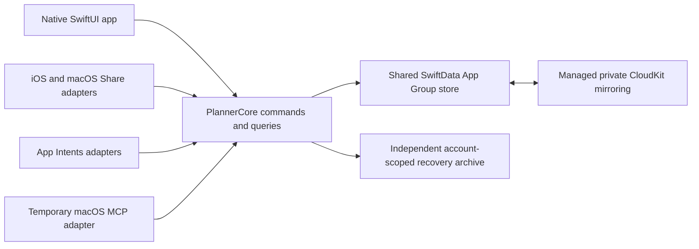

# Core architecture

Decision record in progress for [Core architecture](https://github.com/dvcol/planner/issues/12), claimed for the 2026-10-08 architecture discussion. The human accepted A1-A15, including the import/recovery follow-ups now numbered A12-A15 without dotted labels. A10 follows Apple recommendations and does not accept the earlier two-store bridge proposal. A16-A20 are the current questions. No runnable project, schema, public Swift signature, detailed runtime save mechanism or prototype result is approved by this record yet.

## Context and starting state

The map's destination is an implementation-ready specification with demonstrated native feasibility, not production delivery. The repository contains planning documents but no runnable app or package. Native Xcode and a local PlannerCore Swift package are already accepted in [Build workflow](https://github.com/dvcol/planner/issues/18). The named architecture blockers are closed: Apple capabilities, Duration and search, Itineraries and scheduling, Offline conflicts and recovery, URL and share capture, Build workflow and Native long-list capabilities.

The architecture must keep the accepted [completion](completion-scopes.md), [scheduling](itineraries-and-scheduling.md), [capture](url-and-share-capture.md), [recovery](offline-conflicts-and-recovery.md) and [search](duration-and-search.md) behavior. Shared Item content stays live. Each itinerary item appearance has independent local completion; global Item Done overrides display without overwriting local flags. Progress counts item appearances, including repeated List expansion. Containers derive completion and their bulk actions remain local. There is no Trash or automatic visit lifecycle. Apple Calendar export remains outside the map.

Saved on this device requires both local persistence and independent recoverability under R21. Accepted A15 distinguishes validation/database failures, which leave the action unapplied, from recovery-copy failure after commit, which retains the complete action and reports incomplete recovery. Bulk/import remains one local domain transaction. Host/extension termination cannot be described as rollback or success without evidence about the operation. Old-account recovery cannot automatically upload into a different account.

## Verified facts and their limits

Read-only fact investigations checked Apple primary sources and installed Xcode 27 SDK declarations. They did not run prototypes or change provisioning/accounts.

| Fact and primary source | Consequence for this design |
| --- | --- |
| Apple supports one [multiplatform app target](https://developer.apple.com/documentation/xcode/configuring-a-multiplatform-app-target) with platform-specific experiences and configuration. | Native iPad/Mac layouts do not require separate app targets. Accepted A1 selects this topology; conditional embedding/configuration needs actual builds. |
| Share integrations have their own [extension targets](https://developer.apple.com/library/archive/documentation/General/Conceptual/ExtensibilityPG/ExtensionCreation.html) and [platform controllers](https://developer.apple.com/library/archive/documentation/General/Conceptual/ExtensibilityPG/Share.html). | Propose separate mobile/Mac extension products with shared capture behavior and thin native controllers. |
| [SwiftData CloudKit synchronization](https://developer.apple.com/documentation/swiftdata/syncing-model-data-across-a-persons-devices) cannot enforce unique constraints; relationships require compatible optional/inverse configuration and arrive non-atomically. [TN3164](https://developer.apple.com/documentation/technotes/tn3164-debugging-the-synchronization-of-nspersistentcloudkitcontainer) documents ordering limitations. | Stable source/association/appearance identities, saved ordering and membership reconciliation need explicit design and tests. Do not apply standalone membership deduplication to intentional repeated itinerary entries. |
| Apple describes a native conflict winner in [Core Data with CloudKit](https://developer.apple.com/videos/play/wwdc2019/202/?time=1281); the evidence does not establish all accepted independent-field or deletion outcomes. [SwiftData history](https://developer.apple.com/documentation/swiftdata/fetching-and-filtering-time-based-model-changes) is not a documented permanent synchronized deletion ledger. | Independent title/notes preservation and no resurrection remain hard prototype gates. A4 concerns permitted metadata, not proof that a marker design passes. |
| The [SwiftData Group Lab](https://developer.apple.com/videos/play/wwdc2026/8017/) recommends main-app migration ownership, matching CloudKit configuration for shared clients, and coordinated store access. | An extension cannot treat App Group access as command serialization. Accepted A5 requires main-app initialization/migration before Share saves. |
| A [ModelActor](https://developer.apple.com/documentation/swiftdata/modelactor) isolates its own context; the SwiftUI [mainContext](https://developer.apple.com/documentation/swiftdata/modelcontainer/maincontext) is main-actor-bound and autosaving in the environment. | Shared command code can have an owner in each process, but one actor cannot serialize the app and extension together. Unrestricted UI model mutation would bypass the accepted save boundary. |
| [NSFileCoordinator](https://developer.apple.com/documentation/foundation/nsfilecoordinator) coordinates participating file access with bounded lifecycle protection; [atomic file replacement](https://developer.apple.com/documentation/foundation/nsdata) does not commit a database and recovery file together. [Extension completion](https://developer.apple.com/documentation/foundation/nsextensioncontext/completerequest(returningitems:completionhandler:)) is not a persistence receipt. | Save/copy/receipt interruption, concurrent writers and expiry require exact checkpoints. An atomic JSON copy alone does not establish R21/C16. |
| Apple confirms account changes can clear mirrored local data, including unuploaded saves: [Frameworks Engineer guidance](https://developer.apple.com/forums/thread/811294), [SwiftData DTS guidance](https://developer.apple.com/forums/thread/813340). | Recovery must be independent, account-bound and explicitly restored; the mirrored cache alone is insufficient. |
| OS 27 supplies [ResultsObserver](https://developer.apple.com/documentation/swiftdata/resultsobserver) and [batched fetching](https://developer.apple.com/documentation/swiftdata/modelcontext/fetch(_:batchsize:)). | Native observation/fetching is the first candidate, not proof of complete queries, bounded memory or the 5,000-Item/200-List responsiveness gate. |
| [ModelConfiguration](https://developer.apple.com/documentation/swiftdata/modelconfiguration) supports explicit local/private-CloudKit configurations and store URLs. [ModelContext](https://developer.apple.com/documentation/swiftdata/modelcontext) saves pending changes; rollback restores the most recently committed state. | Native APIs do not commit a mirror plus recovery file together. Accepted A15 reports a post-commit copy error as incomplete recovery of an applied action. A custom bridge is not Apple's default recommendation. |
| [PersistentIdentifier](https://developer.apple.com/documentation/swiftdata/persistentidentifier) is store-scoped; decoded identifiers are not equivalent to DefaultStore identifiers. Automatic mirroring cannot enforce unique source UUIDs. | JSON uses Planner-owned IDs. Permitting deleted-ID markers under A4 does not settle ordinary import, explicit restore authorization or the lifetime attached to old references. A7 addresses ordinary import; restoration follows its answer. |
| Apple's [CloudKit approach guidance](https://developer.apple.com/documentation/cloudkit/deciding-whether-cloudkit-is-right-for-your-app) prefers managed NSPersistentCloudKitContainer synchronization when granular control is unnecessary; [SwiftData synchronization](https://developer.apple.com/documentation/swiftdata/syncing-model-data-across-a-persons-devices) uses that container. | Use one shared App Group store and managed private mirroring under A10/A15. The independent account-scoped recovery archive is Planner's additional requirement. No cited Apple source recommends our earlier two-SwiftData-store bidirectional bridge as this app's default. |

## Accepted first architecture round

All six questions were presented separately through the question tool to avoid hiding multiple questions inside one prompt.

| Question | Concrete choice and recommendation | State |
| --- | --- | --- |
| A1: App target topology | One multiplatform SwiftUI app target, two platform Share extension targets and one PlannerCore package. Platform-specific scenes, navigation, menus and layouts remain native. Conditional embedding/configuration must pass actual builds; separate mobile/Mac app targets were not selected. | Accepted through the question tool. |
| A2: Sort preference scope | Remember sort mode/direction per device and view/List identity. Mac can display Tokyo Food by duration while iPhone stays in Manual; neither selection changes the other. Preferences survive relaunch and List rename. The actual saved Manual order remains shared Planner data and syncs. | Accepted through the question tool. |
| A3: Selection on live refresh | Refresh results while retaining details attached to the same valid Item appearance, even when a filter hides its row. Display current data. Removal/deletion of its identity clears selection with an explanation, without retargeting local actions globally. Preserve a surviving visible scroll anchor where possible. | Accepted through the question tool. |
| A4: Minimal deletion metadata | Permit retained deleted identities and necessary deletion metadata, without deleted content or Trash UI. No automatic expiry while obsolete devices may return. The mechanism still requires sync proof; explicit restore/import effects belong to the next round. | Accepted through the question tool. |
| A5: Share initialization/migration | Open Planner once after installation to initialize shared data and again when a schema migration is required. Ready Share then saves the actual Item with the host closed. If setup/migration is needed, request Open Planner without claiming a save. | Accepted through the question tool. |
| A6: Item Last updated meaning | Change the Item timestamp for its own content, label associations, global completion and archive state. Contextual completion/membership/order or shared-label edits update their own records rather than every Item timestamp. Timestamps do not choose CloudKit conflict winners. | Accepted through the question tool. |

## First-round behavior and required tests

A1 fixes the initial target topology, not an approved Xcode project or entitlement configuration. The build prototype must discover the shared schemes, build mobile/Mac products, verify the appropriate embedded Share extension on each, inspect applicable entitlements and demonstrate native layouts. Package-only tests cannot substitute for app/extension builds or signed-device execution.

A2 fixes sort preference scope. Use the existing Tokyo Food identity and saved Manual order D, G, A, C, B, with both state filters Any. Mac selecting Duration ascending returns A, G, B, C, D because the two 60-minute estimates use the title tie-break. The iPhone remains D, G, A, C, B in Manual. Relaunch and renaming the List retain each device's choice under the same List identity. No membership, saved Manual position, source state or other device's preference changes. Exact filtered sequences still come from the accepted search fixtures. A8 below settles account/dataset scope. Public preference/query interfaces need confirmation before /tdd; local preference storage remains implementation discussion.

A3 requires native detail and real-store observation tests. Select Hotel's first itinerary appearance from a Todo query, then locally complete that appearance or receive its global completion from another device. The refreshed result excludes that row but its detail identity and current data remain selected. Another Hotel appearance must not receive its local action. Removing the selected reference clears that selection with an explanation; it cannot fall back to Hotel's global scope or a surviving appearance. Reopen, filtered-out selection and surviving scroll-anchor behavior need platform-specific UI evidence.

A4 permits a mechanism, not a proven merge result. The deletion/reconciliation boundary must retain only the approved technical metadata, exclude deleted content from marker records and ordinary queries, and prevent stale offline source/reference changes from reviving the deleted identity. Test both reconnect orders, relaunch and an old device returning after newer saves. Exact marker fields, export/restore treatment and reference generations remain to be defined.

A5 requires clean-install and older-schema app/extension tests. Before main-app setup, Share requests Open Planner and creates no acknowledged Item. After initialization, Share saves the accepted complete capture with the app closed. An incompatible schema requires main-app migration before another Share save; the extension cannot migrate independently or report success. Signed mobile/Mac embedding, host-closed saves, concurrent access and expiry remain actual prototype gates.

A6 requires independently controlled mutation-time fixtures through the later approved public boundary. Editing Hotel's notes, links/location, estimate, own label associations, global completion or archive state changes Hotel's Last updated value. Moving Hotel between Lists, changing only one appearance's local completion, reordering a reference or renaming its shared Category leaves Hotel's value unchanged and updates the relevant association/container/label instead. Reopen the store and query the same timestamp and identities. Shared-label content still changes everywhere; timestamp fan-out is not required.

## Second architecture round and human responses

The human answered this round and accepted the subsequent four recommendations, recorded as A12-A15. A7 now has explicit Skip/Overwrite semantics. A10 delegates the technical approach to Apple recommendations with A15's truthful failure distinction. Preference keys and save/status outlines still need public-boundary review before /tdd.

| Question | Starting example and recommendation | Consequence and future test |
| --- | --- | --- |
| A7: Import conflict modes | Accepted two-mode direction, completed by A12-A14: whole-record Skip/Overwrite, default Skip, dependency-conflict skipping and explicit Overwrite restoration. | Skip retains the R5/R19 current-record default. Overwrite adds a reviewed alternative. Invalid files still obey R12; valid-file conflict handling does not silently create dangling references. |
| A8: Sort preferences across accounts/datasets | Accepted. Scope per-device preferences by dataset/account and stable view/List identity. Account B starts with defaults even if a restored List shares A's UUID. Returning to A retains its choice. | Verify switch, relaunch, rename and same-UUID/different-dataset cases without changing shared Manual order. This concerns sort preferences, not a new calendar timezone policy. |
| A9: Data-only JSON backups | Accepted. Backup contains data, not application state. Exclude per-device sort choices, display-zone overrides, navigation, selection and other device presentation state. Import preserves the receiving device's choices; a new view uses defaults. | Export still preserves saved Manual order, content, IDs, completion, references, schedules and planning zones. JSON round-trip verifies those values while receiver preferences remain unchanged. Credentials and transient provider caches remain excluded. |
| A10: Apple-recommended architecture | Accepted technical direction is managed SwiftData/private-CloudKit mirroring in one shared store, independent account-scoped recovery for R13/R21 and main-app migration ownership under A5. | The earlier canonical-store-plus-mirror bridge is unaccepted and not documented as Apple's default. A recovery archive is Planner-added. Accepted A15 supplies the post-commit failure outcome; the exact checkpoint/ownership protocol still needs definition and proof. |
| A11: Native comparison APIs | Accepted fixed-locale Foundation case/diacritic-insensitive matching and title comparison. Use native `range(of:options:range:locale:)` and `String.Comparator`, preserving whitespace terms and literal punctuation. Equivalent titles tie by stable Item UUID ascending in both directions. | French, English and Turkish device settings must give the exact fixture results. Test composed/decomposed accents, `CAFÉ`/`cafe`, punctuation, cross-field terms and UUID ties. Preserve original text. No custom matcher, fuzzy dependency, numeric/width/forced ordering or asynchronous index dependency is needed. Store translation and performance still need runtime proof. |

The native comparison facts come from Apple's [string searching guidance](https://developer.apple.com/library/archive/documentation/MacOSX/Conceptual/BPInternational/InternationalizingYourCode/InternationalizingYourCode.html), [comparator initializer](https://developer.apple.com/documentation/swift/string/comparator/init(options:locale:order:)) and [forced-ordering option](https://developer.apple.com/documentation/foundation/nsstring/compareoptions/forcedordering). Fixed locale removes device-language dependence; exact Unicode results remain runtime fixtures, not a claim of permanent collation invariance.

## Accepted import and recovery follow-ups

The human accepted all four recommendations. The former dotted question labels are replaced here by sequential A12-A15. These are future test expectations, not executed tests. Import mode governs the local import and does not override the native winner of later competing cloud edits.

| Question | Accepted before/action/after outcome | Test obligation |
| --- | --- | --- |
| A12: Mode definition and default | Current X says Current, incoming X says Backup plus new Z. Default Skip retains the entire current X and adds Z once. Overwrite replaces X's full portable values under the same identity and adds Z once. Matching List/Itinerary contents, order and local state are included in whole-record replacement; removed memberships do not delete source Items. Identical records are no-ops; absence from the file never deletes current data. Preview all replacements. Invalid files reject together in either mode. | Test both modes, matching containers and repeated import through the approved public boundary, real-store reopen and native preview/cancellation. Source identities remain unique and omitted W survives. |
| A13: Skip dependencies | A valid backup has deleted X, new Z and new B requiring X/Z. Keep X deleted, skip/report all of B as a dependency conflict and import independent Z. Do not silently shorten B. If conflicted X is live instead, B can reference current X and imported Z. Apply the same dependency logic to new Itineraries, Schedules and owned reference data. | Verify selected identity sets and complete owners after reopen. A truly unresolved file still rejects together; mode conflict handling cannot turn that invalid file into partial success. |
| A14: Explicit Overwrite restoration | Preview and separately confirm reviving backed-up deleted X with the same Planner identity, incoming content and included references. Retain old-lifetime deletion metadata so obsolete offline edits/references cannot revive or replace the restored X. References absent from the backup do not return. No Trash UI is introduced. | Cancel changes nothing. Confirmed restoration keeps reviewed IDs/state/references. Both reconnect orders and stale-device relaunch must retain restored content and suppress old references without duplicate Items. |
| A15: Post-commit recovery error | Validation/database failure leaves the complete action unapplied. Database commit followed by recovery-archive failure retains the complete local action, reports incomplete recovery and retries the checkpoint without duplicating it. Do not report R21 Saved on this device success until persistence and independent recovery are established. | Inject genuine precommit failure and postcommit copy failure separately. Query/reopen exact state, resolve the existing operation and finish recovery without reapplying the mutation. Test app and host-closed Share termination at every checkpoint. |

Accepted A15 refines R6/import failure wording while preserving local all-or-nothing domain changes and R21's recovery acknowledgement. The native default does not establish a transaction across the database and independent archive. Copying an SQLite file alone is not the recovery design, because committed transactions may remain in WAL; Apple's [QA1809](https://developer.apple.com/library/archive/qa/qa1809/_index.html) describes that limitation. The generation/receipt/account/termination mechanism remains to be confirmed and proven.

## Current round, awaiting A16-A20

Each question was presented separately through the question tool. Sequential numbers continue from the accepted follow-ups. None of these recommendations is accepted yet.

| Question | Proposed outcome and independently specified test | Alternative |
| --- | --- | --- |
| A16: Deletion records in backups | Include minimal deleted-ID/lifetime records without deleted content. Restore a backup made after deleting X, then Skip an older X backup: X remains deleted. Incoming deletion metadata against current live X is a conflict; Skip retains X, while Overwrite requires reviewed deletion impact. App state, account credentials, receipts and CloudKit tokens remain outside portable JSON. | Export surviving objects only, without portable deletion history. |
| A17: Duplicate-context completion | Two devices independently add X to A; one new local context becomes Done and the other stays Todo. Consolidate to one visible membership/local context with Done retained, without changing global X. Apply the same rule to physical duplicates of one itinerary completion context, never intentional repeated appearances. After consolidation, ordinary Complete/Reopen uses the single context; late aliases cannot lock it permanently Done or change unrelated contexts. | Keep the deterministic survivor's flag even if the deliberate Done is discarded. |
| A18: Mutations during incomplete recovery | After a known complete commit but failed archive checkpoint, temporarily refuse further mutations in that dataset until recovery succeeds. Reads, search and export remain available; retry completes the original checkpoint. Ordinary offline use and cloud delays do not trigger this restriction. | Accept more edits and prove an ordered queue of incomplete recovery work. |
| A19: Indeterminate prepared-only operation | If a process dies and account reset removes both committed-receipt sources, preserve the prepared proposal separately and report that the outcome cannot be verified. No success, rollback assertion or automatic replay. Inspection/export and a fresh explicitly reviewed restore/retry choose the target dataset. Previously acknowledged recovery remains valid. | Require a definitive commit answer even after all committed evidence is lost. |
| A20: Concurrent explicit restoration | Two devices restore different versions of deleted X. Converge to one visible X/consistent restored version; independent imported Items/containers survive and their newly authorized references follow X. Old deleted-lifetime references stay suppressed. Native resolution applies where shared record identity permits it; duplicate identity/lifetime reconciliation remains a prototype gate. A later reviewed Overwrite can choose different content. | Add a special post-reconnect conflict-review workflow for choosing the restored version. |

The [prototype-ready blueprint draft](architecture-blueprint.md) records routine target/ownership choices, candidate records, public service outlines and focused commands. It is not public-interface approval or runtime evidence; it cannot choose the pending product outcomes above.

## Candidate ownership and data flow

This proposal keeps one PlannerCore library for domain rules, canonical commands/queries, persistence coordination and JSON portability. Use source folders for responsibilities; additional package targets must have a concrete extension-safety or dependency purpose. Native screens, lifecycle controllers, App Intents registration and macOS MCP transport remain adapters.

The diagram shows the accepted Apple-managed baseline and independent recovery role. Detailed checkpoint/account ownership and public-boundary review still gate the complete save/recovery design.

The arrows assign implementation ownership, not an atomic transaction across stores or one shared runtime actor. A command owner in each process would validate current identity/account/target state, apply the local action and establish the approved recovery acknowledgement. Cross-process coordination, imported changes and account resets must be designed separately. UI editors use unsaved draft values so persistence is not accidentally committed through autosave; queries expose current canonical meaning without copying persistent source content into each reference.

Use native mirroring as the baseline under the human's A10 direction. The independent archive is an app requirement beyond the standard mirrored-store lifecycle. Snapshot/receipt generations, staging/recovery of interrupted operations, process coordination and account binding must be specified and proven. A different authoritative store or CKSyncEngine is a reconsideration if this baseline cannot meet the confirmed contract, not an Apple recommendation inferred merely because the APIs exist.

The database transaction groups each complete action and operation receipt without saving unrelated drafts. An independent checkpoint preserves the complete Planner state for the correct account. Native export/import remains asynchronous; neither a successful archive nor an available account proves the latest save uploaded. A15 requires distinct unapplied, committed with recovery incomplete, and recoverably saved outcomes. Pending A19 addresses the exceptional loss of both committed-receipt sources after an account reset.

## Public-boundary discussion and test obligations

No signatures are approved. This ticket must present concrete service outlines and state ownership after the current answers; Shared command contracts will formalize transport/operation shapes. Before /tdd, the human confirms the public boundary and each behavior has an independently specified expectation.

| Boundary to define | Starting fixture, action and required evidence |
| --- | --- |
| Global/contextual commands and progress queries | Use the accepted Hotel/Museum and overlap fixtures: 1 of 3 locally, 2 of 3 under global Hotel Done, retained local flags after Global Reopen; repeated List expansion 1 of 10 then 1 of 12. Query and reopen the exact identities/states/counts. |
| Save, recovery and operation-status queries | Genuine pre-commit failure leaves no new capture. Acknowledged save survives relaunch/termination with independent recovery. Resolve each save/copy/receipt interruption and unchanged-operation replay without claiming unknown rollback or duplicate creation. Exact topology/checkpoints still need human review and real-store/device tests. |
| Shared process access and migration gate | Host closed and concurrent host/extension saves produce the accepted complete local capture with one membership per selected List. A5 requires main-app first setup/migration. Incompatible schema cannot trigger independent extension migration or false success. |
| Membership, occurrence identity/order and deletion reconciliation | Concurrent standalone additions converge to one membership; intentional separate itinerary additions retain distinct appearances; replay retains one operation result. Delete defeats stale edits; removal defeats old association edits without resetting surviving appearances. Include both reconnect orders and reopen. |
| Canonical search, sort and live observation | Use exact search fixtures across device languages and all matching data, including a match beyond the initial window. A2/A3/A6/A8/A9/A11 settle preference scope, selection, timestamps, portability and native comparison. Cancel/discard obsolete query generations; measure cold/warm native performance and traverse results without omissions/duplicates. |
| Native date validation and display | Use the accepted civil-range, Tokyo/Paris instant/display and New York gap/repeat/end fixtures. No estimated end, silent DST normalization, zone-only rescheduling or Calendar export adapter is introduced. |
| Versioned portability and migrations | Full versioned backup preserves source/reference/local state/order. Add-missing/keep-current and whole-invalid rejection retain accepted outcomes. Accepted A4 requires explicit deleted-ID restore rules; older-schema stores and skipped-version upgrades need real fixtures. |
| Native builds and adapter equivalence | Commit the Xcode project/package, configuration, shared schemes, test targets, correct extensions and pinned dependencies. Verify focused app/extension builds, native launches, unit/integration/UI suites and signed device gates separately. SwiftUI, Share, Intents and MCP share one domain implementation. |

## Completion of this architecture ticket

The ticket stays open. It must settle app/package paths and targets, versioned schema fields/reference lifetime/order/provenance, actor/process ownership, recovery and account isolation, canonical query/observation, numeric/input limits and service outlines. Candidate test interfaces, error/cancellation outcomes and reproducible focused build/test commands need human confirmation. Prototype exit criteria must cover the strict reliability requirements; API documentation does not make them pass.

This architecture record documents accepted choices and open proposals. Document validation covers Markdown lint, links, whitespace and published-source/ticket readback. No Swift code was changed, so unit/build/type checks are not applicable to this progress record. Code-producing prototypes retain their required /tdd, native UI and physical-device evidence.
