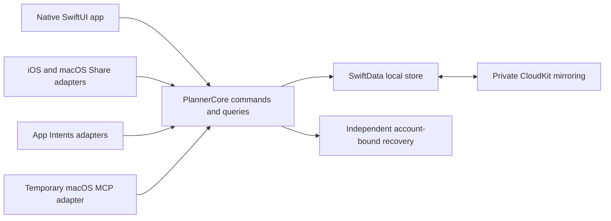

# Core architecture

Decision record in progress for [Core architecture](https://github.com/dvcol/planner/issues/12), claimed for the 2026-10-08 architecture discussion. The first architecture round, A1-A6 below, is awaiting the human. Recommendations are proposals, not accepted decisions. No project, schema, public Swift signature, runtime save mechanism or prototype result is approved by this record yet.

## Context and starting state

The map's destination is an implementation-ready specification with demonstrated native feasibility, not production delivery. The repository contains planning documents but no runnable app or package. Native Xcode and a local PlannerCore Swift package are already accepted in [Build workflow](https://github.com/dvcol/planner/issues/18). The named architecture blockers are closed: Apple capabilities, Duration and search, Itineraries and scheduling, Offline conflicts and recovery, URL and share capture, Build workflow and Native long-list capabilities.

The architecture must keep the accepted [completion](completion-scopes.md), [scheduling](itineraries-and-scheduling.md), [capture](url-and-share-capture.md), [recovery](offline-conflicts-and-recovery.md) and [search](duration-and-search.md) behavior. Shared Item content stays live. Each itinerary item appearance has independent local completion; global Item Done overrides display without overwriting local flags. Progress counts item appearances, including repeated List expansion. Containers derive completion and their bulk actions remain local. There is no Trash or automatic visit lifecycle. Apple Calendar export remains outside the map.

Saved on this device requires both local persistence and independent recoverability under R21. Bulk/import failures must retain the approved local state. Host/extension termination cannot be described as rollback or success without resolving the operation. Old-account recovery cannot automatically upload into a different account. These requirements are not weakened by selecting a simpler design.

## Verified facts and their limits

Read-only fact investigations checked Apple primary sources and installed Xcode 27 SDK declarations. They did not run prototypes or change provisioning/accounts.

| Fact and primary source | Consequence for this design |
| --- | --- |
| Apple supports one [multiplatform app target](https://developer.apple.com/documentation/xcode/configuring-a-multiplatform-app-target) with platform-specific experiences and configuration. | Native iPad/Mac layouts do not require separate app targets. A1 still decides the target topology; conditional embedding/configuration needs actual builds. |
| Share integrations have their own [extension targets](https://developer.apple.com/library/archive/documentation/General/Conceptual/ExtensibilityPG/ExtensionCreation.html) and [platform controllers](https://developer.apple.com/library/archive/documentation/General/Conceptual/ExtensibilityPG/Share.html). | Propose separate mobile/Mac extension products with shared capture behavior and thin native controllers. |
| [SwiftData CloudKit synchronization](https://developer.apple.com/documentation/swiftdata/syncing-model-data-across-a-persons-devices) cannot enforce unique constraints; relationships require compatible optional/inverse configuration and arrive non-atomically. [TN3164](https://developer.apple.com/documentation/technotes/tn3164-debugging-the-synchronization-of-nspersistentcloudkitcontainer) documents ordering limitations. | Stable source/association/appearance identities, saved ordering and membership reconciliation need explicit design and tests. Do not apply standalone membership deduplication to intentional repeated itinerary entries. |
| Apple describes a native conflict winner in [Core Data with CloudKit](https://developer.apple.com/videos/play/wwdc2019/202/?time=1281); the evidence does not establish all accepted independent-field or deletion outcomes. [SwiftData history](https://developer.apple.com/documentation/swiftdata/fetching-and-filtering-time-based-model-changes) is not a documented permanent synchronized deletion ledger. | Independent title/notes preservation and no resurrection remain hard prototype gates. A4 concerns permitted metadata, not proof that a marker design passes. |
| The [SwiftData Group Lab](https://developer.apple.com/videos/play/wwdc2026/8017/) recommends main-app migration ownership, matching CloudKit configuration for shared clients, and coordinated store access. | An extension cannot treat App Group access as command serialization or migrate independently by default. A5 decides the setup experience. |
| A [ModelActor](https://developer.apple.com/documentation/swiftdata/modelactor) isolates its own context; the SwiftUI [mainContext](https://developer.apple.com/documentation/swiftdata/modelcontainer/maincontext) is main-actor-bound and autosaving in the environment. | Shared command code can have an owner in each process, but one actor cannot serialize the app and extension together. Unrestricted UI model mutation would bypass the accepted save boundary. |
| [NSFileCoordinator](https://developer.apple.com/documentation/foundation/nsfilecoordinator) coordinates participating file access with bounded lifecycle protection; [atomic file replacement](https://developer.apple.com/documentation/foundation/nsdata) does not commit a database and recovery file together. [Extension completion](https://developer.apple.com/documentation/foundation/nsextensioncontext/completerequest(returningitems:completionhandler:)) is not a persistence receipt. | Save/copy/receipt interruption, concurrent writers and expiry require exact checkpoints. An atomic JSON copy alone does not establish R21/C16. |
| Apple confirms account changes can clear mirrored local data, including unuploaded saves: [Frameworks Engineer guidance](https://developer.apple.com/forums/thread/811294), [SwiftData DTS guidance](https://developer.apple.com/forums/thread/813340). | Recovery must be independent, account-bound and explicitly restored; the mirrored cache alone is insufficient. |
| OS 27 supplies [ResultsObserver](https://developer.apple.com/documentation/swiftdata/resultsobserver) and [batched fetching](https://developer.apple.com/documentation/swiftdata/modelcontext/fetch(_:batchsize:)). | Native observation/fetching is the first candidate, not proof of complete queries, bounded memory or the 5,000-Item/200-List responsiveness gate. |

## First architecture round, awaiting answers

All six questions were presented separately through the question tool to avoid hiding multiple questions inside one prompt.

| Question | Concrete choice and recommendation | State |
| --- | --- | --- |
| A1: App target topology | One multiplatform SwiftUI app target, two platform Share extension targets and one PlannerCore package is recommended. The alternative has separate mobile/Mac app targets using the same Core. Both require native platform experiences and actual embedding/entitlement verification. | Awaiting human. |
| A2: Sort preference scope | Mac displays Tokyo Food by duration while iPhone uses Manual. Recommend remembering sort mode/direction per device and view/List identity; the actual saved Manual order still syncs. Alternative synchronizes the selected display sort across devices. | Awaiting human. |
| A3: Selection on live refresh | A selected appearance stops matching the Todo filter. Recommend refreshing the list while retaining its valid detail selection; removal/deletion of its identity clears selection without retargeting local actions globally. Preserve a surviving scroll anchor where possible. Alternative clears selection as soon as its row leaves the query. | Awaiting human. |
| A4: Minimal deletion metadata | Recommend permitting deleted identities and necessary deletion metadata without deleted content or Trash UI, with no automatic expiry while obsolete devices may return. Alternative requires a proven obsolete-device/reset policy without retained markers. Either mechanism still needs sync proof. Explicit restore/import effects depend on this answer and belong to a later round. | Awaiting human. |
| A5: Share initialization/migration | Recommend opening Planner once to initialize shared data and again when a schema migration is required. Ready Share then saves the actual Item with the host closed. Alternative targets Share-first initial setup through a separately proven initialization path; the app still owns migrations. | Awaiting human. |
| A6: Item Last updated meaning | Recommend Item timestamp changes for its own content, label associations, global completion and archive state. Contextual completion/membership/order or shared-label edits update their own records rather than every Item timestamp. Alternative counts organizational/context changes as Item updates too. Timestamps do not choose CloudKit conflict winners. | Awaiting human. |

## Candidate ownership and data flow

This proposal keeps one PlannerCore library for domain rules, canonical commands/queries, persistence coordination and JSON portability. Use source folders for responsibilities; additional package targets must have a concrete extension-safety or dependency purpose. Native screens, lifecycle controllers, App Intents registration and macOS MCP transport remain adapters.

The arrows assign implementation ownership, not an atomic transaction across stores or one shared runtime actor. A command owner in each process would validate current identity/account/target state, apply the local action and establish the approved recovery acknowledgement. Cross-process coordination, imported changes and account resets must be designed separately. UI editors use unsaved draft values so persistence is not accidentally committed through autosave; queries expose current canonical meaning without copying persistent source content into each reference.

The smallest storage candidates are mirrored SwiftData plus independent snapshot/receipts, or mirrored SwiftData plus recovery journal/checkpoints. A separately authoritative local store with a mirrored projection adds a bridge and more reconciliation. None is selected or proven. App-specific CKSyncEngine handling is another native path if automatic mirroring cannot pass, but changing the accepted sync design requires explicit review rather than silently weakening its guarantees.

## Public-boundary discussion and test obligations

No signatures are approved. This ticket must present concrete service outlines and state ownership after the current answers; Shared command contracts will formalize transport/operation shapes. Before /tdd, the human confirms the public boundary and each behavior has an independently specified expectation.

| Boundary to define | Starting fixture, action and required evidence |
| --- | --- |
| Global/contextual commands and progress queries | Use the accepted Hotel/Museum and overlap fixtures: 1 of 3 locally, 2 of 3 under global Hotel Done, retained local flags after Global Reopen; repeated List expansion 1 of 10 then 1 of 12. Query and reopen the exact identities/states/counts. |
| Save, recovery and operation-status queries | Genuine pre-commit failure leaves no new capture. Acknowledged save survives relaunch/termination with independent recovery. Resolve each save/copy/receipt interruption and unchanged-operation replay without claiming unknown rollback or duplicate creation. Exact topology/checkpoints still need human review and real-store/device tests. |
| Shared process access and migration gate | Host closed and concurrent host/extension saves produce the accepted complete local capture with one membership per selected List. A5 determines first-use behavior. Incompatible schema cannot trigger independent extension migration or false success. |
| Membership, occurrence identity/order and deletion reconciliation | Concurrent standalone additions converge to one membership; intentional separate itinerary additions retain distinct appearances; replay retains one operation result. Delete defeats stale edits; removal defeats old association edits without resetting surviving appearances. Include both reconnect orders and reopen. |
| Canonical search, sort and live observation | Use exact search fixtures across device languages and all matching data, including a match beyond the initial window. A2/A3/A6 settle preference scope, selection and timestamp semantics. Cancel/discard obsolete query generations; measure cold/warm native performance and traverse results without omissions/duplicates. |
| Native date validation and display | Use the accepted civil-range, Tokyo/Paris instant/display and New York gap/repeat/end fixtures. No estimated end, silent DST normalization, zone-only rescheduling or Calendar export adapter is introduced. |
| Versioned portability and migrations | Full versioned backup preserves source/reference/local state/order. Add-missing/keep-current and whole-invalid rejection retain accepted outcomes. A4 may require explicit deleted-ID restore rules; older-schema stores and skipped-version upgrades need real fixtures. |
| Native builds and adapter equivalence | Commit the Xcode project/package, configuration, shared schemes, test targets, correct extensions and pinned dependencies. Verify focused app/extension builds, native launches, unit/integration/UI suites and signed device gates separately. SwiftUI, Share, Intents and MCP share one domain implementation. |

## Completion of this architecture ticket

The ticket stays open. It must settle app/package paths and targets, versioned schema fields/reference lifetime/order/provenance, actor/process ownership, recovery and account isolation, canonical query/observation, numeric/input limits and service outlines. Candidate test interfaces, error/cancellation outcomes and reproducible focused build/test commands need human confirmation. Prototype exit criteria must cover the strict reliability requirements; API documentation does not make them pass.

This first round is a reviewable starting artifact. Document validation covers Markdown lint, links, whitespace and published-source/ticket readback. No Swift code was changed, so unit/build/type checks are not applicable to this progress record. Code-producing prototypes retain their required /tdd, native UI and physical-device evidence.
