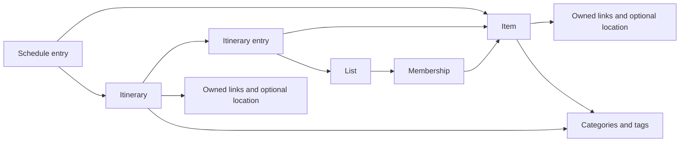

# Planner vocabulary

Review artifact for [Planner vocabulary](https://github.com/dvcol/planner/issues/3), updated on 2026-10-08. The user's completion/archive and membership answers below are confirmed. The full glossary and ownership sketch remain open for final review; this document is not a closed-ticket resolution.

The [product brief](product-brief.md) supplies the generic item, many-to-many lists, stable identities, and referenced itineraries/schedules. [Release goals](release-goals.md) keeps places and scheduled itineraries as the first daily-use journeys. The [glossary](../GLOSSARY.md) gives those concepts one common vocabulary. There is no application code or agreed production interface yet.

## Confirmed behavior

The user confirmed these decisions on 2026-10-08:

- Items have no special repeat-visit behavior. A museum and an ordinary todo use the same item model; a later visit does not automatically create an item, reopen an item, or create visit history.
- Removing the last list membership preserves the item in Inbox/All Items. Visibility still follows the selected completion and archive filters.
- Todo/done and active/archived are independent states. Archiving does not complete an item. Unarchiving a done item leaves it done.

All four combinations are valid:

| Completion | Archive state | Meaning |
| --- | --- | --- |
| Todo | Active | Unfinished and available for ordinary planning. |
| Done | Active | Finished and unarchived; ordinary todo views exclude it. |
| Todo | Archived | Unfinished but put away. |
| Done | Archived | Finished and put away. |

An ordinary todo view includes only todo + active items. "Active" alone means unarchived, so an active-only filter must not silently mean todo-only. [Duration and search](https://github.com/dvcol/planner/issues/8) owns explicit filter composition and section defaults.

## Ownership and references for review

The arrows describe domain references and content ownership. They do not specify SwiftData relationships, delete rules, or concurrency.

| Concept | Owns | References and identity |
| --- | --- | --- |
| Item | Title, notes, completion/archive state, links, optional location and duration estimate | One stable identity across lists, itineraries and schedules. Place metadata does not make it a separate task system. |
| List | Its name and presentation metadata | Memberships reference existing item identities. Removing a membership does not remove the item. |
| Membership | The association between one item and one list, with any list-local ordering | Refers to the same item, never a list-specific copy. Duplicate-association and concurrent-order policies belong to recovery. |
| Category and Tag | User-defined name, optional color/icon | Proposed shared classifications referenced by items/itineraries. Whether renaming updates every use needs the user's answer. |
| Link and Location | Content attached to the owning item or itinerary | Editable metadata rather than a separate todo or automatically shared venue history. Capture/provenance decisions govern provider fields. |
| Itinerary | Its own title, notes, metadata and explicit status | Contains ordered references to existing items/lists. Child progress and itinerary completion behavior belong to scheduling. |
| Itinerary entry | Its position within an itinerary | References an existing source; changing order does not change that source's identity or memberships. Nesting and list expansion remain in scheduling. |
| Schedule entry | Its planning date/time assignment | References an existing item or itinerary. Schedule forms, multiple occurrences and time zones remain in scheduling. |

Independent source identities and reference records must survive saving and reopening. [Core architecture](https://github.com/dvcol/planner/issues/12) decides the concrete record identities and persistence representation; [Shared command contracts](https://github.com/dvcol/planner/issues/13) decides public operation shapes.

## Before and after examples

Use one existing `Nezu Museum` item with stable identity `11111111-1111-1111-1111-111111111111`. Lists A, B, C and D mean `Tokyo Museums`, `Wishlist`, `Weekend` and `Art`. Each row states its own starting fixture unless it explicitly names the preceding row.

| Operation | Before | Required end state |
| --- | --- | --- |
| Add to list C | The item belongs to A and B. | The same item belongs to A, B and C. Existing memberships remain. |
| Remove from list A | After the preceding add, memberships are A, B and C. | Memberships are B and C; identity and content are unchanged. |
| Move from B to D | After the preceding removal, memberships are B and C. | Memberships are C and D. Only the explicitly selected B membership is replaced. |
| Remove last membership | The item belongs only to A, is todo + active, and has an itinerary and schedule reference. | Memberships are empty. The same item is available in Inbox/All Items, and its content and references remain. |
| Complete | The item is todo + active in A and B, with itinerary and schedule references. | It is done + active with the same identity, memberships and references. Ordinary todo views in A and B exclude it; an explicit completed query can find it. |
| Reopen | The item is done + archived in A and B. | It is todo + archived. Reopening changes completion only. |
| Archive | The item is todo + active in A and B. | It is todo + archived. Memberships, identity, content and references remain. |
| Unarchive | The item is done + archived in A and B. | It is done + active. It remains absent from ordinary todo views until separately reopened. |
| Complete an archived item | The item is todo + archived. | It becomes done + archived; completion does not unarchive it. |
| Reopen then unarchive | The item is done + archived. | Reopen yields todo + archived; unarchive yields todo + active. Ordinary todo views can show it again. |
| Edit a referenced source | An itinerary entry and schedule entry reference the existing item. | Editing its title changes that item; the references retain its identity and display its current content. |
| Add an itinerary or schedule reference | The existing item has no such reference. | The reference points to that existing item. The number of items and its list memberships stay unchanged. |
| Consider another museum visit | The item is done + active. | Merely planning to revisit has no automatic effect. The user can use ordinary create/reopen operations if desired; there is no inferred visit lifecycle. |

Use distinct verbs: complete/reopen change completion; archive/unarchive change archive state. A standalone "restore" is ambiguous and must not silently perform both. If trash is adopted, its recovery operation needs an explicit meaning in the recovery and command-contract decisions.

## Decisions owned by later tickets

| Question | Owner and required outcome |
| --- | --- |
| Delete a list, delete an item, restore deleted references, or permanently delete a referenced source | [Offline conflicts and recovery](https://github.com/dvcol/planner/issues/10) must state retained content, memberships, reference treatment and recovery. Removing membership and archiving are already distinct from deletion. |
| Concurrent complete/reopen, archive/unarchive, membership duplication or reorder | [Offline conflicts and recovery](https://github.com/dvcol/planner/issues/10) must supply exact converged states and permitted temporary states. Independent completion/archive changes must be represented in its fixtures. |
| Nested itineraries, live list expansion, progress, explicit itinerary completion, schedule forms and repeated schedule occurrences | [Itineraries and scheduling](https://github.com/dvcol/planner/issues/9) must give exact reference and display outcomes. It must not introduce automatic visit history or a separate place-task lifecycle. |
| Duration presets, label matching, independent completion/archive filters, Inbox and Done section defaults | [Duration and search](https://github.com/dvcol/planner/issues/8) must provide worked comparisons and query results. |
| Provider metadata and edits to partial captures | [URL and share capture](https://github.com/dvcol/planner/issues/11), using [Place-data provenance](https://github.com/dvcol/planner/issues/5). |
| Record identities, storage relationships, public commands and queries | [Core architecture](https://github.com/dvcol/planner/issues/12) and [Shared command contracts](https://github.com/dvcol/planner/issues/13). No production signatures or test seams are approved here. |

## Required implementation evidence

These are future `/tdd` obligations, not tests reported as passing. Confirm the public command/query seams before writing tests, then implement one failing behavior and its minimum passing implementation at a time.

| Level | Fixture and action | Expected observation |
| --- | --- | --- |
| Domain unit | Execute add C, remove A, move B to D through public commands. | Query the same item identity and exact membership sets A/B/C, B/C, then C/D. |
| Domain unit | Remove the only membership from a todo + active item. | Inbox/All Items queries return that identity, with content and existing itinerary/schedule references preserved. |
| Domain unit | Exercise complete, reopen, archive and unarchive from the combinations above. | Only the named state changes. The resulting pairs match the table and content/memberships/references remain intact. |
| Domain unit | Complete an item referenced by lists, an itinerary and a schedule. | Todo views exclude it everywhere; explicit completed queries return the same identity; both references remain. |
| Domain unit | Add itinerary and schedule references, then edit the source title. | Item count is unchanged; both references retain the source identity and read the updated title. Exact schedule setup comes from scheduling. |
| Persistence integration | Save four items covering all completion/archive combinations and representative memberships/references, close and reopen a real temporary store. | Public queries return the original identities, all four state pairs, the exact membership sets and intact references. |
| UI | Display an item belonging to A and B, then swipe complete from A. | The UI indicates multiple memberships; ordinary todo views in both A and B exclude it, and a completed view can find it. |
| UI | Unarchive a done item, then explicitly reopen it. | Unarchive leaves it done and absent from ordinary todo views; reopen makes it todo + active and visible there. |
| Physical two-device integration | Change completion on one device and archive state on another. | The accepted recovery scenario determines convergence; queries and UI show both independent states. This is a recovery/prototype gate, not a claimed CloudKit guarantee. |

Deleting sources, trash recovery, concurrent conflict winners and itinerary progress cannot be tested against invented expectations. Their named owners must resolve those outcomes first. Documentation validation checks the four state pairs, before/after examples and links; it cannot prove runtime behavior.

## Remaining vocabulary review

Confirm whether categories and tags are shared labels: renaming `Food` to `Dining`, or changing its color/icon, updates all associated items and itineraries without changing their identities. The recommended answer is yes. The glossary and remaining ownership/operation examples then need final human acceptance before this ticket can close.
