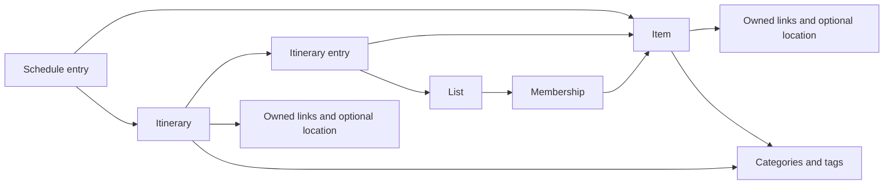

# Planner vocabulary

Accepted resolution for [Planner vocabulary](https://github.com/dvcol/planner/issues/3), confirmed by the human on 2026-10-08. The glossary, ownership sketch and operation examples below govern later decisions. Production interfaces and the explicitly delegated policies still belong to their named tickets.

The later [Completion scopes and derived progress](https://github.com/dvcol/planner/issues/22) clarification supersedes this record's global-only completion and independent itinerary-completion assumptions. Source content remains shared, but contextual item completion can differ between lists/itineraries, global Done overrides its effective display, and container completion derives from contextual children. See [Completion scopes](completion-scopes.md) for the accepted rule and exact fixtures. The global-operation examples below remain baseline examples; they do not prohibit local completion.

The later [Offline conflicts and recovery](offline-conflicts-and-recovery.md) answers confirm that Lists have their own archive state and container Archive/Delete affects only that container. Ordinary re-addition starts local Todo after the final path was removed; Undo or restoration of the original association preserves its local state. R14 replaces the earlier Trash choice with Archive plus confirmed Delete. Delete removes the selected entity and its references while retaining source Items/Lists of deleted containers. There is no Trash lifecycle or Trash Restore operation. Concurrent outcomes and recovery interactions remain with the recovery record.

R15-R20 in that record also settle deletion precedence over offline edits, one membership/local context per Item/List pair, preservation of independent membership additions, converged ordering without dropped members, distinct same-name Category/Tag identities, preservation of matching container contents on import, and explicit separate account recovery. Architecture and prototypes must establish representation and runtime evidence for those product requirements.

The [product brief](product-brief.md) supplies the generic item, many-to-many lists, stable identities, and referenced itineraries/schedules. [Release goals](release-goals.md) keeps places and scheduled itineraries as the first daily-use journeys. The [glossary](../GLOSSARY.md) gives those concepts one common vocabulary. There is no application code or agreed production interface yet.

## Confirmed behavior

The user confirmed these decisions on 2026-10-08:

- Items have no special repeat-visit behavior. A museum and an ordinary todo use the same item model; a later visit does not automatically create an item, reopen an item, or create visit history.
- Removing the last list membership preserves the item in Inbox/All Items. Visibility still follows the selected completion and archive filters.
- Todo/done and active/archived are independent states. Archiving does not complete an item. Unarchiving a done item leaves it done.
- Categories and tags are shared objects. Items and itineraries reference them, so changing a label's name, color or icon updates every use without changing the referring item's or itinerary's identity.

All four combinations are valid:

| Completion | Archive state | Meaning |
| --- | --- | --- |
| Todo | Active | Unfinished and available for ordinary planning. |
| Done | Active | Finished and unarchived; ordinary todo views exclude it. |
| Todo | Archived | Unfinished but put away. |
| Done | Archived | Finished and put away. |

An ordinary todo view includes only todo + active items, using global completion in global item scope and effective completion in a list/itinerary scope. "Active" alone means unarchived, so an active-only filter must not silently mean todo-only. [Duration and search](https://github.com/dvcol/planner/issues/8) owns explicit filter composition and section defaults; Completion scopes supplies the newer contextual meaning.

## Ownership and references

The arrows describe domain references and content ownership. They do not specify SwiftData relationships, delete rules, or concurrency.

| Concept | Owns | References and identity |
| --- | --- | --- |
| Item | Title, notes, global completion/archive state, links, optional location and duration estimate | One stable identity across lists, itineraries and schedules. Contextual completion does not create another item. |
| List | Its name, presentation metadata and archive state, with completion derived from its contextual children | Memberships reference existing item identities. Removing a membership does not remove the item. Container Archive/Delete leaves referenced source states unchanged. |
| Membership | The association between one item and one list, with local completion and any list-local ordering | At most one association/local context per Item/List pair, referencing the same item rather than a copy. Recovery supplies removal/re-add and concurrent membership/order outcomes; architecture must implement reconciliation. |
| Category and Tag | User-defined name, optional color/icon | Each has a shared identity referenced by items/itineraries. Names may repeat without merging distinct identities. Editing an object updates every reference to that identity; no per-item label copy needs synchronization. |
| Link and Location | Content attached to the owning item or itinerary | Editable metadata rather than a separate todo or automatically shared venue history. Capture/provenance decisions govern provider fields. |
| Itinerary | Its own title, notes, metadata and archive state, with contextual item completion | Contains ordered live references to existing items/lists. Completion derives from contextual children; the old explicit parent-completion proposal is superseded. |
| Itinerary entry | Its position within an itinerary | References an existing item/list; changing order does not change its source identity or memberships. Scheduling Q12 gives each itinerary item appearance independent local completion, including repeated direct or List references. A source list's local completion does not contribute to the itinerary's completion. |
| Schedule entry | Its planning date/time assignment | References an existing item or itinerary. Schedule forms, multiple occurrences and time zones remain in scheduling. |

Independent source identities and reference records must survive saving and reopening. [Core architecture](https://github.com/dvcol/planner/issues/12) decides the concrete record identities and persistence representation; [Shared command contracts](https://github.com/dvcol/planner/issues/13) decides public operation shapes.

## Before and after examples

Use one existing `Nezu Museum` item with stable identity `11111111-1111-1111-1111-111111111111`. Lists A, B, C and D mean `Tokyo Museums`, `Wishlist`, `Weekend` and `Art`. Each row states its own starting fixture unless it explicitly names the preceding row.

The baseline global-operation rows explicitly start with Todo contextual completion values unless a row states otherwise. This is fixture data consistent with the accepted new-local-state Todo rule. Global Reopen reveals these retained values; local Done cases are supplied separately.

For shared-label cases, use a `Food` category with a red color and fork/knife icon, and a `rainy-day` tag. Edit the category to `Dining`, blue and a cup/saucer icon, and rename the tag to `indoors`. These are user-visible fixture values; architecture chooses their concrete representation.

| Operation | Before | Required end state |
| --- | --- | --- |
| Add to list C | The item belongs to A and B. | The same item belongs to A, B and C. Existing memberships remain. |
| Remove from list A | After the preceding add, memberships are A, B and C. | Memberships are B and C; identity and content are unchanged. |
| Move from B to D | After the preceding removal, memberships are B and C. | Memberships are C and D. Only the explicitly selected B membership is replaced. |
| Remove last membership | The item belongs only to A, is todo + active, and has an itinerary and schedule reference. | Memberships are empty. The same item is available in Inbox/All Items, and its content and references remain. |
| Complete | The item is todo + active in A and B, with itinerary and schedule references. | It is done + active with the same identity, memberships and references. Ordinary todo views in A and B exclude it; an explicit completed query can find it. |
| Reopen | The item is done + archived in A and B. | It is todo + archived. Reopening changes completion only. |
| Archive | The item is todo + active in A and B. | It is todo + archived. Memberships, identity, content and references remain. |
| Unarchive | The item is done + archived in A and B. | It is done + active. It remains absent from ordinary todo views until separately reopened. |
| Complete an archived item | The item is todo + archived. | It becomes done + archived; completion does not unarchive it. |
| Reopen then unarchive | The item is done + archived. | Reopen yields todo + archived; unarchive yields todo + active. Ordinary todo views can show it again. |
| Edit a referenced source | An itinerary entry and schedule entry reference the existing item. | Editing its title changes that item; the references retain its identity and display its current content. |
| Edit a shared category | Two items and an itinerary reference the same `Food` category with a red color and fork/knife icon. | Rename it to `Dining`, blue and a cup/saucer icon. All three show those values, retaining their identities and their references to the same category identity. |
| Edit a shared tag | Two items and an itinerary reference the same tag named `rainy-day`. | Rename it to `indoors`. All three show `indoors` through the same tag identity; memberships and schedule/itinerary references remain intact. |
| Add an itinerary or schedule reference | The existing item has no such reference. | The reference points to that existing item. The number of items and its list memberships stay unchanged. |
| Consider another museum visit | The item is done + active. | Merely planning to revisit has no automatic effect. The user can use ordinary create/reopen operations if desired; there is no inferred visit lifecycle. |

Use distinct verbs: complete/reopen change completion; archive/unarchive change archive state. Confirmed Delete removes the selected entity and its references. Undo of an original association retains its prior contextual value, while ordinary re-addition starts local Todo. There is no Trash Restore operation. JSON restoration and independent account recovery retain their accepted data-preservation requirements.

## Decisions owned by later tickets

| Question | Owner and required outcome |
| --- | --- |
| Delete a list, delete an item, restore deleted references, or permanently delete a referenced source | [Offline conflicts and recovery](https://github.com/dvcol/planner/issues/10) must state retained content, memberships, reference treatment and recovery. Removing membership and archiving are already distinct from deletion. |
| Concurrent complete/reopen, archive/unarchive, membership duplication or reorder | [Offline conflicts and recovery](https://github.com/dvcol/planner/issues/10) must supply exact converged states and permitted temporary states. Independent completion/archive changes must be represented in its fixtures. |
| Global/contextual completion, derived progress and local bulk actions | The accepted [Completion scopes](completion-scopes.md) fixtures supply effective-state, initialization, independent per-appearance contexts and local-only bulk actions. Scheduling Q14 reopens numeric counting of repeated appearances. These replace the earlier global-only and explicit parent-completion assumptions. Public seams and recovery remain downstream work. |
| Live itinerary composition, schedule forms and repeated schedule occurrences | [Itineraries and scheduling](https://github.com/dvcol/planner/issues/9) must give exact reference and display outcomes. Flat live item/list composition is accepted; nested itineraries and automatic visit history are excluded. |
| Duration presets, label matching, independent completion/archive filters, Inbox and Done section defaults | [Duration and search](https://github.com/dvcol/planner/issues/8) must provide worked comparisons and query results. |
| Provider metadata and edits to partial captures | [URL and share capture](https://github.com/dvcol/planner/issues/11), using [Place-data provenance](https://github.com/dvcol/planner/issues/5). |
| Record identities, storage relationships, public commands and queries | [Core architecture](https://github.com/dvcol/planner/issues/12) and [Shared command contracts](https://github.com/dvcol/planner/issues/13). No production signatures or test seams are approved here. |

## Required implementation evidence

These are future `/tdd` obligations, not tests reported as passing. Confirm the public command/query seams before writing tests, then implement one failing behavior and its minimum passing implementation at a time.

| Level | Fixture and action | Expected observation |
| --- | --- | --- |
| Domain unit | Execute add C, remove A, move B to D through public commands. | Query the same item identity and exact membership sets A/B/C, B/C, then C/D. |
| Domain unit | Remove the only membership from a todo + active item. | Inbox/All Items queries return that identity, with content and existing itinerary/schedule references preserved. |
| Domain unit | Exercise complete, reopen, archive and unarchive from the combinations above. | Only the named state changes. The resulting pairs match the table and content/memberships/references remain intact. |
| Domain unit | Complete an item referenced by lists, an itinerary and a schedule. | Todo views exclude it everywhere; explicit completed queries return the same identity; both references remain. |
| Domain unit | Add itinerary and schedule references, then edit the source title. | Item count is unchanged; both references retain the source identity and read the updated title. Exact schedule setup comes from scheduling. |
| Domain unit | Two items and one itinerary reference the same `Food` category and `rainy-day` tag. Edit the category to `Dining`, blue and a cup/saucer icon, and rename the tag to `indoors`. | Public queries for all three return `Dining`, blue, the cup/saucer icon and `indoors`. Category/tag identities and all source identities/references are unchanged. |
| Persistence integration | Save four items covering all completion/archive combinations and representative memberships/references, close and reopen a real temporary store. | Public queries return the original identities, all four state pairs, the exact membership sets and intact references. |
| Persistence integration | Save two items and an itinerary referencing the same category/tag, edit those labels, then reopen a real temporary store. | Public queries return the updated shared metadata and the original label/source identities and references; no independent stale label copies appear. |
| UI | Display a globally Todo item in A/B with both local states Todo; complete it only in A. | A's todo query excludes it; B and global todo queries still include the same source. Shared content and memberships remain intact. |
| UI | With local A Done and B Todo, complete then reopen the item globally. | Global Done excludes it from both contextual todo views. Global Reopen reveals A Done/B Todo again without changing retained local states. |
| UI | Unarchive a done item, then explicitly reopen it. | Unarchive leaves it done and absent from ordinary todo views; reopen makes it todo + active and visible there. |
| UI | Rename the category/tag from its editor while two items and an itinerary reference it. | Their displayed labels update without individually editing the referring sources. Query matching after a rename follows the search decision. |
| Physical two-device integration | Change completion on one device and archive state on another. | The accepted recovery scenario determines convergence; queries and UI show both independent states. This is a recovery/prototype gate, not a claimed CloudKit guarantee. |

The completion and recovery records provide accepted progress, Archive plus confirmed Delete, import failure and independent local recovery requirements. Remaining concurrent/recovery interactions require their named owners' exact outcomes before tests. Documentation validation checks the four state pairs, before/after examples and links; it cannot prove runtime behavior.

## Acceptance and limits

The human confirmed that items and itineraries point to a category/tag object, so updating that object updates every use. Together with the earlier state/membership answers and the presented glossary/operation review, this settles the vocabulary. Label deletion, concurrent label edits, text/query matching after a rename and persistence topology remain with recovery, search and architecture. No unit, integration, UI or physical-device runtime evidence is claimed by this documentation resolution.
